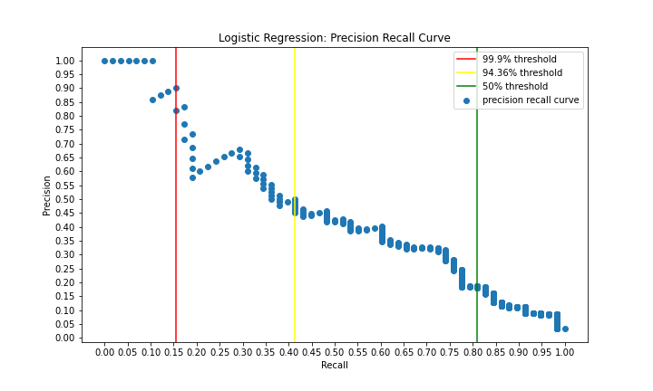
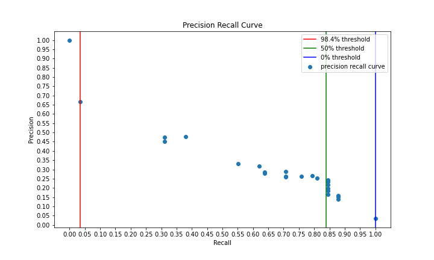
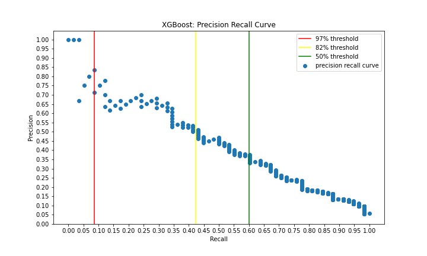

# Machine Learning Algorithms for Bankruptcy Prediction

In this project I look at financial data for companies listed on Taiwan's stock exchange between 1999 and 2009 and test a series of classification models that use this data to predict which companies are likely to go bankrupt. A bankruptcy prediction model can help investors or fund managers to assess the risk of holding shares of a given company as well as the opportunities and risks of short selling a company's shares. This is purely an educational project so none of the recommendations in it should be construed as financial advice.

## Business Application

There are two main ways that investors can make use of our model:

1. They can use it to pursue a conservative investment strategy by avoiding companies with a high probability of bankruptcy. 
2. They can use it to identify companies that are highly likely to go bankrupt and attempt to profit from shorting the shares of those companies.

## Model Evaluation

I'm going to be evaluating the performance of my models primarily based on the F1 scores for the bankruptcy class, since this number incorporates both:

1. What percentage of all bankruptcies our predictions account for (recall) and
2. What percentage of our bankruptcy predictions are correct (precision).

F1 is defined as:

2 * precision * recall / (precision + recall)

A high f1 score means that our model is both able to achieve our conservative goal of separating bankruptcies from non-bankruptcies as well as our aggressive goal of finding a high precision bankruptcy class. 

## Simplifying Assumptions

In determining potential profits and losses from various investment strategies I'll be making two basic assumptions:

1. Bankruptcy reduces the value of a company's shares to zero.
2. The profit from shorting selling the shares of companies that go bankrupt is on average equal to the losses from short selling the shares of companies that don't go bankrupt.

The first assumption is realistic and allows us to calculate expected losses due to bankruptcy. For example, if we are able to predict non-bankruptcies with 99% precision at a certain probability threshold, then we can expect losses of 1%.

While the second assumption is unrealistic, it's useful because it means that if we are able to predict bankruptcies with >50% precision at a given probability threshold, then we can expect that profits will exceed losses if we short the shares of companies whose probability of bankruptcy falls above the threshold. In the real world, our model would have to use additional factors to determine expected profits and losses, but making this assumption is the best way to quantify the risk of shorting strategies given only the information available in our data set.

## The Data

### Class Imbalance

This data set is highly imbalanced with only 3.2% of companies belonging to the bankruptcy class. This means that a model that predicts the majority class 100% of the time will have 96.8% accuracy. If we're trying to pick out non-bankruptcies for a conservative investment strategy, then we want our model to be able to do so with >96.8% precision, since otherwise, we would be just as well off investing randomly in the market without the aid of a model.

### Data Features

#### Scaling

Most of the data set has already been min-max scaled. This makes the data less interpretable, since we don't know true min and max values. The best way to interpet the data is therefore to convert values using a standard scaler, which enables us to discuss the data points in terms of z-scores (standard deviations from the mean). 

Twenty four columns appeared to be inconsistenty min-max scaled. Most of these had max values of around 10 billion, while median values were below 1. I didn't want to eliminate the rows with outlying values because I didn't want to bias the data set against high values, especially since this would likely reduced the minority class represented in the data set still further. I therefore dropped the columns that hadn't been min-maxed scaled.

#### Correlated variables

The data set included two pairs of variables that were perfectly correlated - in one case because they were definitionally identical and in another case because they represented an accounting identity. These variables were eliminated from the model.

There were also around 10 pairs of variables that had above 99.9% correlation. These included Net Value for Class A, Class B, and Class C shares. It makes sense that different classes of shares of the same company would typically move up and down together. However, because owners of different classes of shares may fare differently in the event of a bankruptcy, I chose not to remove these variables from the model. Tree models would almost certainly only make use of one of these variables as would a Logistic Regression Model making use of Regularization.

## Models Used

### Baseline Model: Depth 2 Decision Tree:

Our baseline model is a decision tree algorithm. It divides the test data into a bankruptcy class and non-bankruptcy class by choosing a splitting criterion that minimizes the entropy within each class. An entropy of 1 means that a node of the tree is split evenly between classes, while an entropy of 0 means that the node is composed of only a single class. Because an unweighted model would give us close to zero entropy at the tree's root, I scaled the minority class by a balancing factor to give the root node an entropy of zero. 

After dividing the data into a bankruptcy class and a non-bankruptcy class, the tree also divided each of these classes into low entropy and high entropy leaves.

Below we can see how this decision tree performed on the testing data:

With an F1 score of 0.17, the baseline model successfully picked out 49 out of 58 bankruptcies, but it also yielded 456 false positives. With 99% precision at picking out non-bankruptcies, it's quite useful for giving us a conservative investment strategy, but useless for identifying companies whose shares we might want to short.

Looking at the histograms below, we can see why the decision tree's first splitting criterion - the Net Income to Total Assets Ratio - is so effective at filtering out bankruptcies:

The overwhelming majority of bankrupt companies fall below the Income Asset Ratio decision threshold, while non-bankrupt companies are somewhat more likely to fall above the threshold. This 'somewhat more likely' is the key problem with our baseline model and the reason why our F1 score is so low.

### Logistic Regression Model

Using grid search, I built a logistic regression model that uses lasso regularization with a C value of e^-1. This model eliminated 21 variables and yielded an F1 score of 0.3 on my testing data. As the confusion matrix below shows, the recall is only slightly worse than the baseline model, while the number of false positives have been cut in half.

One of the benefits of the logistic regression model is that its probability function produces a unique probability value for each point in our testing data. This means that we can easily adjust the probability threshold we want our decision function to use. A higher probability threshold can be used if we want to maximize our model's precision, while a low probability threshold can be used if we want to maximize our model's recall. The precision recall curve below shows this tradeoff, with vertical lines showing the probability thresholds at which each tradeoff occurs.

With a 99% precision for predicting non-bankruptcies, the 50% probability threshold is useful for making conservative investments (beating the market by 2 points) but not useful for identifying stocks to short since it consists of 82% false positives. On the other hand, we have a false positive rate of only 10% above the 99.9% probability threshold. At this threshold, we pick out 9 true positive bankruptcies plus one false positive. 

Looking at the curve we can see how the seven highest probability data points were all true positives. Then we see the presence of the eighth data point cause the precision to plummet from 100% below 90%. Then, with the inclusion of two more true positives, we see the precision rise back to 90%.

### Decision Tree #2:

The second decision tree model I built has a maximum depth of 6, which allows it to fit better on the training data. On the testing data, it has a recall of 0.84 and a precision of 0.2, which means that it's recall improved by 3 points compared to the Logistic Regression Model while its precision improved by two points, yielding an F1 score of 0.32, an improvement of 2 points over logistic regression model at the 50% probability threshold and a 15 point improvement over the baseline. However, if we look at the precision recall curve, we see that the precision drops must faster in this model than it does in the logistic regression model.

There are fewer points defining this curve than there are defining the logistic regression curve, because there isn't a probability value for each point of testing data but only for each leaf of the decision tree. At the second highest threshold, there is one false positive for two true positives, as we can see by the fact that the precision drops from 100% to 67%. The small number of data points at high probability thresholds makes this model useless for predicting bankruptcies with precision, though at a 50% threshold we could use it to reduce bankruptcies to below 1% of our portfolio.

### Random Forest

The random forest algorithm generates a forest of decision trees that are each built on a random subset of the training data and select decision criteria from a random subset of features. The probability function is defined by the percentage of trees that 'vote' for a given class. At a 50% probability threshold, the model continues to improve upon previous models, with an F1 score of 0.38. We get this score through a 1 pt. decrease in recall compared to  Decision Tree #2 (down to 0.83 from 0.84) and a 5 point increase in precision compared to Decision Tree #2 (up to 0.25 from 0.2).

Again, this makes our model very useful for making conservative investments, but how well does it do at picking out a high precision set of high-probability bankruptcies?

At the right side of the curve, each point corresponds to many data points that got the same small number of votes. However, on the left side of of the curve, each probability corresponds to a unique number of votes. This means that we can see how each false or true positive affects the rise and fall of the curve. Thus we see three true positive followed by a false positive (the dip), followed by three more true positives, followed by another false positive. Precision then flattens out to around 50% between the two yellow lines, before slowly declining. This yields an 80% precision for the top ten probabilities for this model set as opposed to a 90% precision for the top ten probabilities for the linear regression model. One reason for this may be the Rotten Tomatoes Effect--whereby movies that have many slightly positive reviews will be rated as 100% Fresh, while movies with many rave reviews and a few negative reviews will receive a rating below 100%. Similarly, the voting-based decision tree algorithm doesn't take account of the entropy of individual leaves, just of the overall decision made by each tree.

### XGBoost

XGBoost is an machine learning algorithm based on gradient boosted tree models. The model is first trained using weak learners--trees that don't maximize information gain (unlike information-maximizing nodes generated by a Decision Tree Model). New weak learners are then trained on the errors made by their predecessors. The final algorithm uses the combined training of many weak learners to make its predictions on the test data.

Because XGBoost has a tendency to overfit on the training data -- especially if tree depths are too big or the number of estimators used is too great, I was conservative in the criteria I used to perform my grid search. The model that grid search ultimately selected used a max-depth of 4, a minimum child weight of 0.2, 60 estimators and a lambda regularization of 64. 

This yielded an F1 score of 0.45 at the 50% probability threshold, which was obtained through a lower recall of 0.6 and a higher precision of 0.35. 

At higher probabilities, the precision was similar to that of the Random Forest Model, though it took longer for precision to dip down to 50%:

